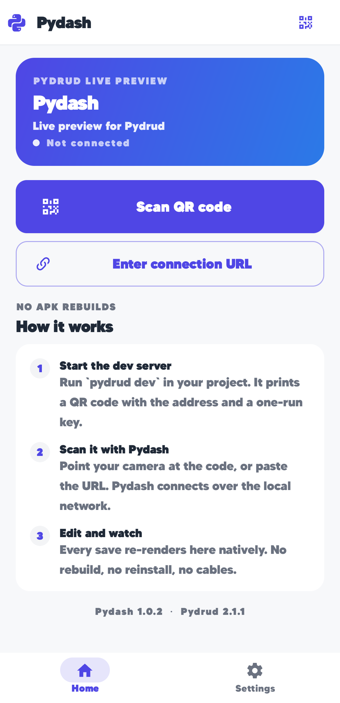

<p align="center">
  
  
  
  
</p>

<h1 align="center">Pydash</h1>

<p align="center">
  <strong>The live preview client for <a href="https://github.com/MurShidM01/Pydrud">Pydrud</a> apps — no APK rebuilds.</strong><br>
  Run <code>pydrud dev</code>, point Pydash at the QR code, and the project's UI renders natively on your phone over Wi-Fi.
</p>

<p align="center">
  
</p>

---

Pydash is the **Expo Go of the Pydrud ecosystem**. Run `pydrud dev` on your
computer, scan the QR code it prints, and the project's UI renders natively on
your phone over Wi-Fi. Edit Python, save, and the screen updates — no
reinstall, no cable, no build step.

Pydash is itself a Pydrud project. It targets Android through the Chaquopy
runtime, so the preview client is a normal installable APK; the apps it
previews are not.

```
  computer                                   phone
  ────────                                   ─────
  pydrud dev  ──▶  pydrud://preview/connect?…  ──▶  Pydash
     │                                                  │
     │  preview_hello  ◀──────────────────────────────  │  handshake (v1)
     │  preview_welcome ──────────────────────────────▶ │
     │  render_transaction (snapshot) ────────────────▶ │  renderer protocol (v2)
     │  ◀──────────────────────────────  render_ack     │
     │  render_transaction (patch) ───────────────────▶ │
     │  ◀──────────────────────────────  click/change   │  UI events
     ▼                                                  ▼
  Python runs here                         the UI is drawn here
```

## Download

Grab the latest APK from the [**Releases**](https://github.com/MurShidM01/Pydash/releases)
page and install it on any device running **Android 7.0 (API 24)** or newer.

## What it does

- **Scan a QR code.** A live CameraX reader with the native focus frame.
- **Or paste a URL.** Manual entry, with a paste shortcut and inline
  validation — the same rules the host server enforces.
- **Reconnect in one tap.** Recent projects are kept for 15 minutes and listed
  on Home — even while a session is live, so you can switch between them.
  Tapping one re-checks the link with the same spinner the scanner uses.
- **Watch it live.** The remote widget tree is rehydrated into real Pydrud
  widgets and drawn by Pydrud's own renderer, so the preview is the *actual*
  UI — the project's own app bars, navigation and all — not a mock-up.
  Incremental patches keep it in step with every save, and a burst of frames
  (an animation loop) is coalesced so the preview stays responsive instead of
  flooding the render queue.
- **Theme-aware.** The preview adopts the previewed project's palette — its
  background, surfaces and text — so it looks the way it would as a real app,
  and Pydash's own light/dark/system look is restored the moment you leave.
  Pydash's own preview chrome floats on the project's background so it blends
  in rather than framing the mirror in a foreign colour.
- **Honest about failure.** A connect attempt shows a spinner on the screen
  that started it; if the server stops responding, a dialog offers **Go Home**
  or **Retry** instead of leaving a dead stage on screen.
- **Remembers you.** Theme, haptics, auto-reconnect and keep-awake persist
  across relaunches.
- **Deep links.** A tapped `pydash://preview/connect?…` link opens straight
  into a session.

## Screens

| Screen | Route | What it is |
| --- | --- | --- |
| Home | `shell` (tab 0) | Dashboard: connect, live session card, recent apps, "how it works". |
| Settings | `shell` (tab 1) | Theme mode, behaviour switches, versions and device info. |
| Scan | `scan` | Camera QR reader, or manual URL entry (`mode="manual"`). |
| Preview | `preview` | The immersive render of the connected project. |

Home and Settings share one shell — a compact app bar and a Material bottom
navigation bar. Scan and Preview are pushed routes; leaving Preview keeps the
session alive so it can be reopened without re-scanning.

## Run it

```bash
python -m pytest -q tests   # the app's test suite (no device needed)
python run.py               # build the widget tree headlessly
python run.py --tree        # dump the tree as JSON
python run.py --tab 1       # build one shell tab (0 Home, 1 Settings)
```

To build and install the Android client:

```bash
pydrud init android --backend chaquopy   # generate the Android target (once)
pydrud sync                              # refresh generated files
pydrud build --release                   # assemble a release APK
pydrud run                               # build, install, launch and hot-reload
```

Then, in any Pydrud project:

```bash
pydrud dev        # prints the connection QR code and URI
```

## How the preview works

The client speaks two versioned protocols, both mirrored from the framework's
host-only modules (which are pruned from the bundled runtime, so Pydash
carries its own copies):

1. **Preview handshake (v1).** `preview_hello` carries the session id, the
   one-run token and the client's capabilities. The server answers
   `preview_welcome` (project identity, limits) or `preview_reject` (a
   machine-readable reason).
2. **Renderer protocol (v2).** Newline-delimited JSON frames of at most 2 MiB.
   The server sends `render_transaction` frames — a `snapshot` or a set of
   `patch` operations at a revision. The client applies them to its mirror of
   the tree and answers `render_ack` (or `render_nack` when a patch is stale,
   which makes the server resend a snapshot).

Because the mirror re-emits the remote node JSON verbatim, Pydash's own diff
engine produces the same minimal view patches a full APK build would have
applied. UI events travel back as `click`, `change`, `submit`, `back` and
`metrics` frames.

### Security

The pairing token is single-run and the transport is **not encrypted**. Run
`pydrud dev` and Pydash on the same trusted network and never expose the
preview port to the public internet.

## Project layout

```
Pydash/
├── run.py                  device-free builder for quick checks
├── pydrud.yaml             Android target: package, versions, permissions
├── pydrud.toml             Python package declarations and theme seed
├── pyproject.toml          lint (ruff) and pytest configuration
├── docs/                   screenshots used in this README
├── assets/                 app icons and images
├── tests/                  the suite (uri, mirror, protocol, app)
└── src/
    ├── pydrud_config.py    portable app metadata
    └── app/
        ├── main.py         routes, deep links, start-up entry point
        ├── config.py       identity, versions and wire-protocol constants
        ├── theme.py        the palette, generated from one brand colour
        ├── theme.pss       the design system as classes (`class_=`)
        ├── state.py        the reactive State objects
        ├── runtime.py      the router and the running App (`refresh()`)
        ├── prefs.py        persisted settings
        ├── ui.py           compatibility re-exports
        ├── jobs.py         WorkManager entry point (no jobs registered)
        ├── components/     reusable UI: surfaces, brand, status
        ├── preview/        the client side of `pydrud dev`
        │   ├── uri.py      QR payload parsing and validation
        │   ├── models.py   connection states, endpoints, session stats
        │   ├── mirror.py   the mirrored tree and its patch applier
        │   ├── client.py   the socket client: handshake, transactions
        │   ├── session.py  the connection state machine
        │   └── renderer.py the native render + server-command handling
        └── screens/        shell, home, scan, preview, settings
```

## Theming and PSS

The palette is generated from one brand colour in `app/config.py`. Screens
attach classes from `app/theme.pss` with `class_=`, and the stylesheet refers
to colours through `$token` references — so a single stylesheet follows both
the light and the dark palette. Inline `style=` values win where a screen
needs a one-off. Editing `theme.pss` re-skins the app without touching Python.

## Tests

`pydrud.testing.AppTester` boots the app against a protocol reference
renderer, and the protocol tests drive the client against an in-process
socket server — so the whole suite runs without an emulator or a build
toolchain.

```bash
python -m pytest -q tests
python -m ruff check .
```

## Licence

Pydash is released under the MIT licence, like the
[Pydrud](https://github.com/MurShidM01/Pydrud) framework it previews.
